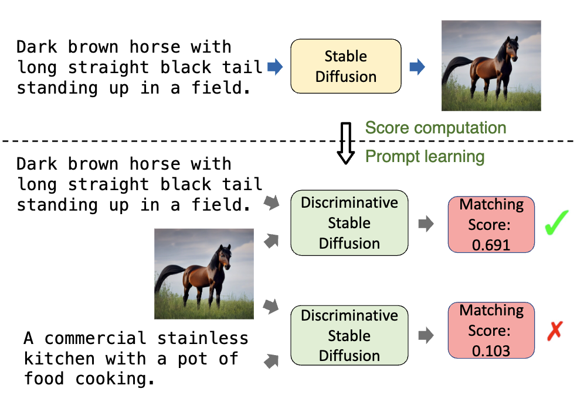

# DSD
This is the code implementation for the paper: "Discriminative Diffusion Models as Few-shot Vision and Language Learners".
The project is developed based on HuggingFace Diffusers.

[Project Page](https://sites.google.com/view/dsddemo)
<div align=center>  

</div>


Diffusion models, such as Stable Diffusion, have shown incredible performance on text-to-image generation. Since text-to-image generation often requires models to generate visual concepts with fine-grained details and attributes specified in text prompts, can we leverage the powerful representations learned by pre-trained diffusion models for discriminative tasks such as image-text matching? To answer this question, we propose a novel approach, Discriminative Stable Diffusion (DSD), which turns pre-trained text-to-image diffusion models into few-shot discriminative learners. Our approach mainly uses the cross-attention score of a Stable Diffusion model to capture the mutual influence between visual and textual information and fine-tune the model via efficient attention-based prompt learning to perform image-text matching. By comparing DSD with state-of-the-art methods on several benchmark datasets, we demonstrate the potential of using pre-trained diffusion models for discriminative tasks with superior results on few-shot image-text matching.


## Env Setup

```
conda create -n dsd python=3.9
conda activate dsd
cd diffusers
pip install -e .
cd ..
pip install -r requirements.txt
```


## Quick Play
### Notebook
We provide a [jupyter notebook file](demo.ipynb) to try the pipeline and visualize. 


### Gradio Demo
You can also launch the gradio demo to upload your own image to play by:
```bash
python playground.py 
```


## Dataset Setup

### ComVG
Download images from Visual Genome official websites.
Put the Visual_Genome in the same path with DSD repo.
Download comvg_train.csv from [link](https://drive.google.com/drive/folders/1GOxInYPaVTZrFkhune-PN8LnV_weSIm6?usp=sharing) and put it in the [data](data) repo.
Or you can directly download com_vg.zip from [link](https://drive.google.com/drive/folders/1GOxInYPaVTZrFkhune-PN8LnV_weSIm6?usp=sharing) and unzip it and put it in the same path with DSD repo.


### RefCOCO
We use the RefCOCOg split.
Download from RefCOCOg github repo https://github.com/lichengunc/refer.
Put refcocog in the same path with DSD repo.


### VQA
Download images from VQAv2 official websites.
Put vqav2 in the same path with DSD repo.
Download vqa_text_train.csv from [link](https://drive.google.com/drive/folders/1GOxInYPaVTZrFkhune-PN8LnV_weSIm6?usp=sharing) and put it in the [data](data) repo.


The repo strutures are 

```
├── DSD/
│   ├── data/
│   │   ├── comvg_train.csv
│   │   ├── vqa_text_train.csv
│   │   └── ...
├── refcocog/
│   ├── images/
│   │   ├── train2014/
│   │   │   ├── COCO_train2014_000000000009.jpg
│   │   │   └── ...
│   │   └── ...
│   ├── refs(google).p
│   └── instances.json
├── vqav2/
│   ├── images/
│   │   └── ...
│   ├── train2014/
│   │   └── ...
│   └── val2014/
│       └── ...
└── Visual_Genome/
    ├── VG_100K/
    └── vg_concept/
        └── 180.jpg
        └── 411.jpg
        └── 414.jpg
        └── 1251.jpg
        └── ...
```


## Experiments
### Test
#### Download pretrained Checkpoints
|                                          ComVG                                           |                                          Refcocog                                          |                            VQA                             |
:------------------------------------------------------------------------------------------------:|:----------------------------------------------------------------------------------------------:|:----------------------------------------------------------------------------------------------:
 [Download](https://drive.google.com/drive/folders/13-v3zShNMVpURBceqJu5T6iGXDBJqL6p?usp=sharing) | [Download](https://drive.google.com/drive/folders/13-v3zShNMVpURBceqJu5T6iGXDBJqL6p?usp=sharing) | [Download](https://drive.google.com/drive/folders/13-v3zShNMVpURBceqJu5T6iGXDBJqL6p?usp=sharing)


#### Run inference with pretrained checkpoints
ComVG
```
accelerate config
accelerate launch dsd_infer.py --val_data ComVG_obj --batchsize 16 --sampling_time_steps 40 --output_dir downloaded_checkpoints
accelerate launch dsd_infer.py --val_data ComVG_verb --batchsize 16 --sampling_time_steps 40 --output_dir downloaded_checkpoints
accelerate launch dsd_infer.py --val_data ComVG_sub --batchsize 16 --sampling_steps 40 --output_dir downloaded_checkpoints
```

`downloaded_checkpoints` is the folder path for your loaded ckpt, such as FOLDER_NAME/checkpoint-500000.


Refcocog
```
accelerate config
accelerate launch dsd_infer.py --val_data Refcocog --batchsize 16 --sampling_time_steps 10 --output_dir downloaded_checkpoints
```

VQAv2
```
accelerate config
accelerate launch dsd_infer.py --val_data vqa_binary --batchsize 16 --sampling_time_steps 200 --output_dir downloaded_checkpoints
accelerate launch dsd_infer.py --val_data vqa_other --batchsize 16 --sampling_time_steps 200 --output_dir downloaded_checkpoints
```


### Train yourself

```
accelerate config
accelerate launch dsd_train.py --pretrained_model_name_or_path stabilityai/stable-diffusion-2-1-base --train_batch_size 1 --val_batch_size 4 --output_dir PATH --train_data TRAIN_DATA --val_data VAL_DATA --num_train_epochs EPOCH --learning_rate 1e-4
```
We set the accelerate config to use one GPU to do the training.  

`TRAIN_DATA` currently supports ComVG, Refcocog, vqa. You can add more in the [custom_dataset](./custom_datasets.py)

`VAL_DATA` supports giving types, e.g. ComVG_obj/ComVG_verb/ComVG_sub, vqa_other/vqa_binary

Set `--bias` if you want to train and inference using the cross-attention score from the diffusion model only. 
For example: 
```
accelerate config
accelerate launch dsd_train.py --pretrained_model_name_or_path stabilityai/stable-diffusion-2-1-base --train_batch_size 1 --val_batch_size 4 --bias --output_dir ./output --train_data ComVG --val_data ComVG_verb --num_train_epochs 1 --learning_rate 1e-4

accelerate config
accelerate launch dsd_infer.py --val_data ComVG_obj --bias --batchsize 16 --sampling_time_steps 30 --output_dir YOUR_SAVED_CKPTS
```


## Acknowledgements
The code and dataset is built on [Stable Diffusion](https://github.com/CompVis/stable-diffusion), [Diffusers](https://github.com/huggingface/diffusers), [Diffusion-itm](https://github.com/McGill-NLP/diffusion-itm), [Custom Diffusion](https://github.com/adobe-research/custom-diffusion), [ComCLIP](https://github.com/eric-ai-lab/ComCLIP), [Refer](https://github.com/lichengunc/refer). We thank the authors for their model and code.


## Citation
If you find it useful in your research or applications, please consider citing us, thanks!
```bibtex
@article{he2023discriminative,
  title={Discriminative Diffusion Models as Few-shot Vision and Language Learners},
  author={He, Xuehai and Feng, Weixi and Fu, Tsu-Jui and Jampani, Varun and Akula, Arjun and Narayana, Pradyumna and Basu, Sugato and Wang, William Yang and Wang, Xin Eric},
  journal={arXiv preprint arXiv:2305.10722},
  year={2023}
}
```
